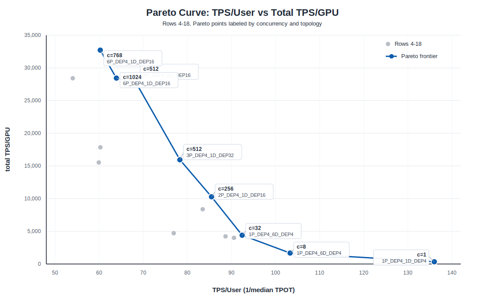

# SA-AgentX GB300 Pareto Configs

Sanitized SRT-SLURM YAML configs for DeepSeek-V4-Pro / SGLang / Dynamo GB300
SA-AgentX benchmark runs.

These files preserve the run topology, concurrency, SGLang backend arguments, and
benchmark shape from the original Pareto-frontier experiments. Cluster-local
paths, account names, and credentials have been replaced with placeholders so the
configs can be shared publicly.

## Configs And Metrics

Metrics are from the `Agentx SGLang Best Known Perf` tab of the SA-AgentX GB300
tracking sheet, rows 4-18. `TPS/User` is `1 / median TPOT`; `total TPS/GPU` is
aggregate throughput normalized per GPU.

## Pareto Curve



| JID | Topology | GPUs | Conc | hicache | TPS/User | total TPS/GPU | Cache hit | P90 TTFT (s) | P50 latency (ms) | P90 latency (ms) |
|---|---|---:|---:|---:|---:|---:|---:|---:|---:|---:|
| jid2098561 | 1P x DEP4 + 1D x DEP16 | 20 | 256 | 4 | 83.47 | 8,371.10 | 74.10% | 153.50 | 84,279.05 | 114,559.22 |
| jid2101637 | 3P x DEP4 + 1D x DEP8 | 20 | 768 | 6 | 54.00 | 28,416.00 | 86.90% | 159.60 | 77,997.69 | 185,586.80 |
| jid2102170 | 2P x DEP4 + 1D x DEP16 | 24 | 256 | 6 | 85.47 | 10,285.20 | 72.40% | 199.70 | 105,621.78 | 213,781.29 |
| jid2106740 | 3P x DEP4 + 1D x DEP16 | 28 | 512 | 6 | 68.50 | 27,546.80 | 89.40% | 96.23 | 48,917.24 | 117,825.89 |
| jid2107404 | 6P x DEP4 + 1D x DEP16 | 40 | 1024 | 6 | 63.90 | 28,438.00 | 88.00% | 95.90 | 61,146.20 | 120,903.83 |
| jid2108001 | 1P x DEP4 + 6D x DEP4 | 28 | 32 | 6 | 92.42 | 4,404.53 | 89.70% | 23.50 | 10,962.63 | 46,019.02 |
| jid2108167 | 1P x DEP4 + 6D x DEP4 | 28 | 8 | 6 | 103.30 | 1,672.60 | 95.00% | 4.07 | 5,592.09 | 23,304.40 |
| jid2109702 | 3P x DEP4 + 1D x DEP32 | 44 | 512 | 6 | 78.30 | 15,944.00 | 88.40% | 121.10 | 51,702.51 | 139,331.99 |
| jid2114646 | 1P x DEP4 + 6D x DEP4 | 28 | 64 | 6 | 88.65 | 4,219.80 | 97.90% | 86.78 | 29,120.92 | 99,872.08 |
| jid2114740 | 1P x DEP4 + 6D x DEP4 | 28 | 64 | 6 | 90.57 | 4,001.50 | 98.10% | 93.12 | 36,305.36 | 105,181.87 |
| jid2132562 | 6P x DEP4 + 1D x DEP8 | 32 | 768 | 6 | 59.90 | 15,530.95 | 82.80% | 175.93 | 138,308.57 | 201,183.32 |
| jid2132800 | 6P x DEP4 + 1D x DEP16 | 40 | 768 | 6 | 60.24 | 32,708.95 | 89.00% | 70.55 | 42,457.43 | 98,790.53 |
| jid2138209 | 3P x DEP4 + 1D x DEP8 | 20 | 384 | 6 | 60.27 | 17,852.43 | 85.70% | 229.90 | 89,833.47 | 249,231.47 |
| jid2138854 | 3P x DEP4 + 1D x DEP8 | 20 | 512 | 6 | 76.90 | 4,709.00 | 32.00% | 339.30 | 201,910.00 | 360,242.00 |

Note: the source config filename uses `jid2138209`; the tracking sheet row with
matching topology and concurrency lists the job id as `213820`.

## Common Settings

- Model: `deepseek-ai/DeepSeek-V4-Pro`
- Precision: FP4
- GPU type: GB300
- Frontend: Dynamo KV router
- Backend: SGLang disaggregated serving
- Transfer backend: Mooncake
- Speculative decoding: EAGLE, 3 steps, top-k 1, 4 draft tokens
- Dataset used in the benchmark commands: SA-AgentX / SemiAnalysis cc-traces

## Placeholders To Fill

Before running, replace these placeholders with your local values:

| Placeholder | Meaning |
|---|---|
| `${MODEL_PATH}` | Local or mounted DeepSeek-V4-Pro checkpoint path |
| `${SGLANG_CONTAINER_SQSH}` | SGLang container image or SquashFS path |
| `${SLURM_ACCOUNT}` | SLURM account |
| `${SLURM_PARTITION}` | SLURM partition |
| `${HOST_LUSTRE_PATH}` | Host path mounted to `/lustre` |
| `${AIPERF_CHECKOUT}` | Local checkout of the benchmark harness mounted to `/aiperf` |
| `${DYNAMO_SRC}` | Dynamo source checkout |
| `${DYNAMO_DIST}` | Dynamo wheel/dist directory |
| `${DYNAMO_INFRA_BIN_DIR}` | Dynamo infra binary directory |
| `${SGLANG_SRC}` | Optional editable SGLang source checkout |

## Running

Example:

```bash
srtctl apply -f disagg-gb3-6p1d-dep4-dep16-mtp-kv-offload-con1024-ratio6-jid2107404.yaml
```

Use `srtctl dry-run -f <config.yaml>` first to inspect generated `sbatch`, `srun`,
mounts, environment, and worker commands for your cluster.

## Sanitization Notes

The public copy intentionally removes:

- literal Hugging Face tokens
- internal filesystem paths
- internal account names
- private source checkout locations

The original topology and SGLang/Dynamo tuning fields are left intact.
